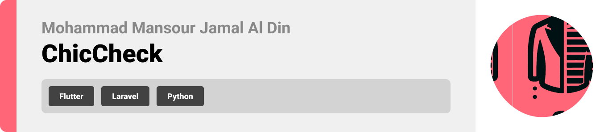
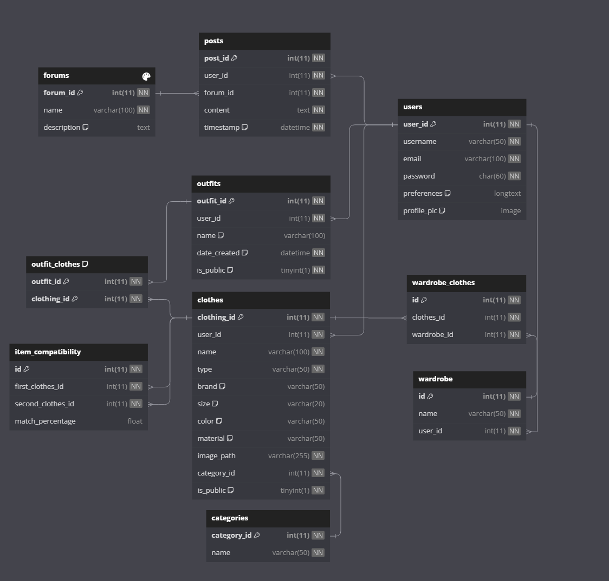
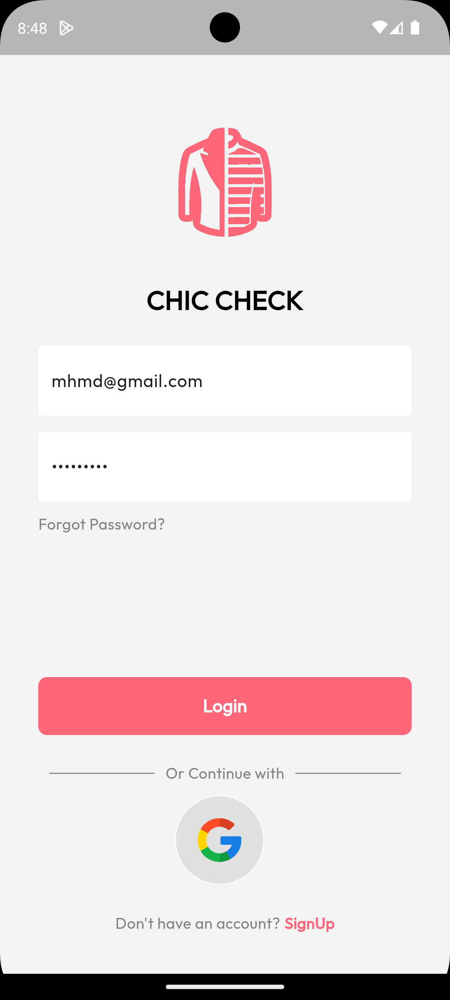
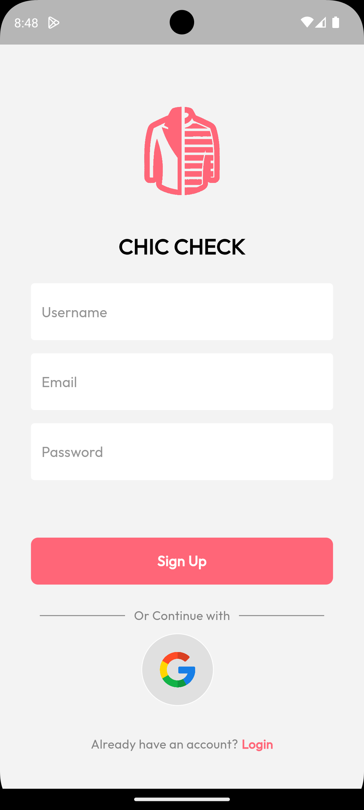
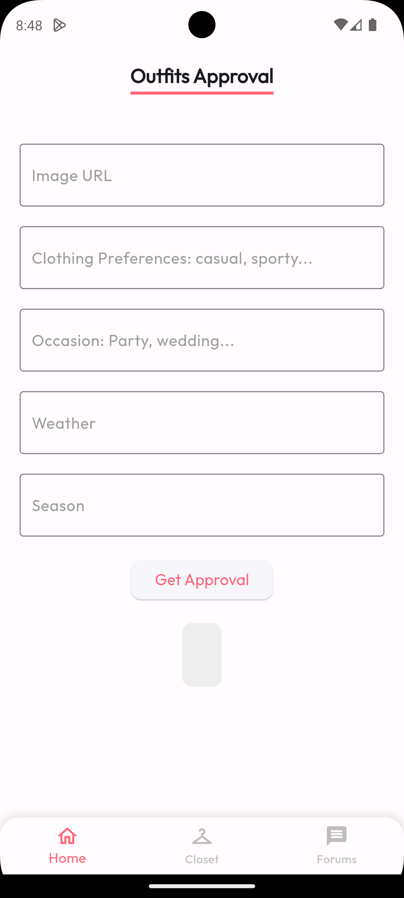
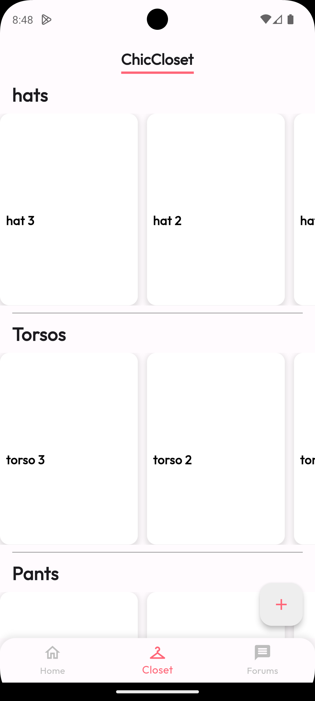
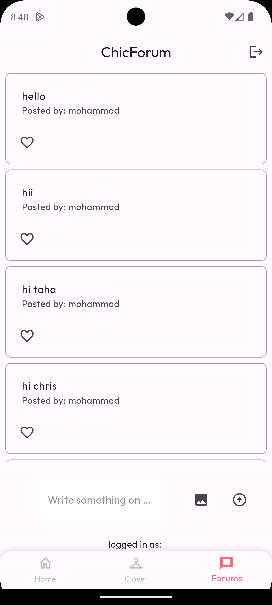
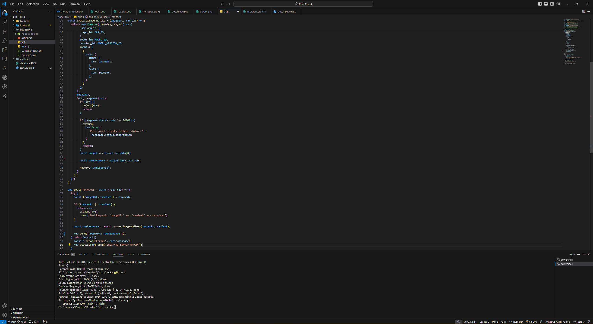

<br><br>

<!-- project philosophy -->


> A mobile app for outfit checking, making it easier for stylish people or the ones who find it difficult to choose their right clothing combo, offering a detailed advice to what change or keep in their outfit.
>
> Chic Check aims to streamline the outfit-pick process by providing a user-friendly platform for all people to check or pick the right outfit through their mobile phone camera at their convenience. We believe in improving peoples outfit pick through a smooth experience while saving time and ensuring their satisfaction.

## User Stories

### User
- As a user, I want to check my an item on my body on the app, so I can make sure Im wearing the right outfit combo.
- As a user, I want to customize my outfit, so I can change or keep specific items according to a criteria and save it.
- As a user, I want to check for the latest outfit trends and whats popular on the app, so it can ease up my choice throughtout the days.

  ### Admin / Company
- As a company using this app, I want to promote my products, so I should have access to adding them.
- As a company, I want to retire some of my products, so I should be able to remove recently added ones.
- As a company, I want to reward users using the app, so I have the ability to put promotions and coupons in it.

<br><br>
<!-- Tech stack -->


###  Chic Check is built using the following technologies:

- This project uses the [Flutter app development framework](https://flutter.dev/). Flutter is a cross-platform hybrid app development platform which allows us to use a single codebase for apps on mobile, desktop, and the web.
- For persistent storage (database), the app uses the [Laravel](https://laravel.com/) package which allows the app to create a custom storage schema and save it to a local database.
  - 🚨 Currently, notifications aren't working on macOS. This is a known issue that we are working to resolve!
- The app uses the font ["Outfit"](https://fonts.google.com/specimen/Outfit) as its main font, and the design of the app adheres to the material design guidelines.

<br><br>
<!-- UI UX -->


> We designed Chic Check using wireframes and mockups, iterating on the design until we reached the ideal layout for easy navigation and a seamless user experience.

- Project Figma design [figma](https://www.figma.com/design/HHCXTOyB9V66AzZvlJPlIx/Chic-Check?node-id=0-1&t=zkAHpNVzG2iOCu6k-0)


<br><br>

<!-- Database Design -->


###  Architecting Data Excellence: Innovative Database Design Strategies:




<br><br>


<!-- Implementation -->


### User Screens (Mobile)
| Login screen  | Register screen | Landing screen | ClosetPage screen |
| ---| ---| ---| ---|
|  |  |  |  |
| ForumPage screen  |
|  |

<br><br>


<!-- Prompt Engineering -->


###  Mastering AI Interaction: Unveiling the Power of Prompt Engineering:

- This project uses advanced prompt engineering techniques to optimize the interaction with natural language processing models. By skillfully crafting input instructions, we tailor the behavior of the models to achieve precise and efficient language understanding and generation for various tasks and preferences.

- Ai Used: Gpt-4o.
  


<br><br>


<!-- How to run -->


> To set up Chic Check locally, follow these steps:

### Prerequisites

This is an example of how to list things you need to use the software and how to install them.
* npm
  ```sh
  npm install npm@latest -g
  ```

### Installation

_Below is an example of how you can instruct your audience on installing and setting up your app. This template doesn't rely on any external dependencies or services._

1. Clone the repo
   git clone [github](https://github.com/MhmdMansour4444/Chic-Check.git)
2. Install flutter dependencies
3. run the laravel server 
```sh
   php artisan server --host= your ip address
   ```
4. run the node server for the ai api
```sh
  node ai.js
```


  

   

Now, you should be able to run Chic Check locally and explore its features.
